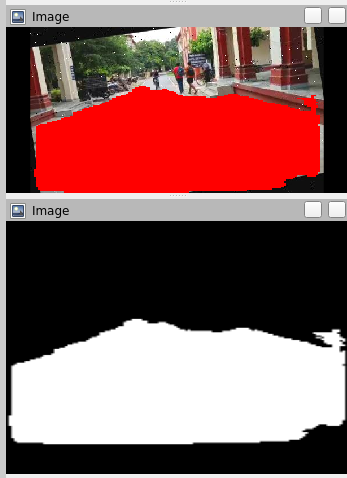
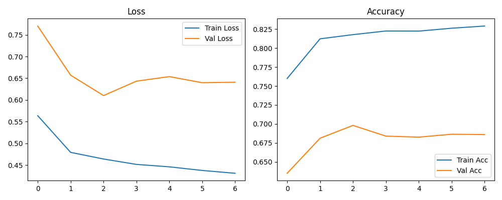
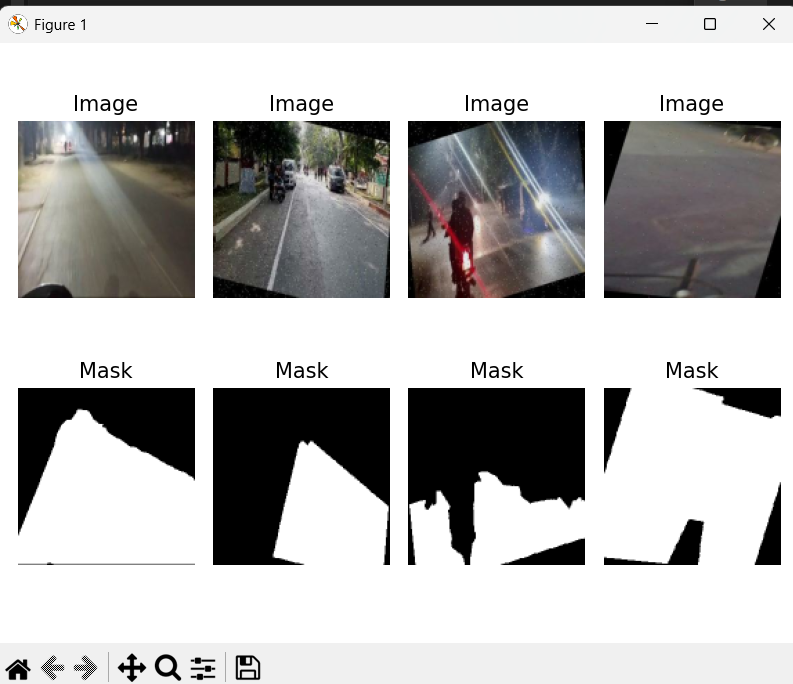
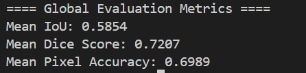
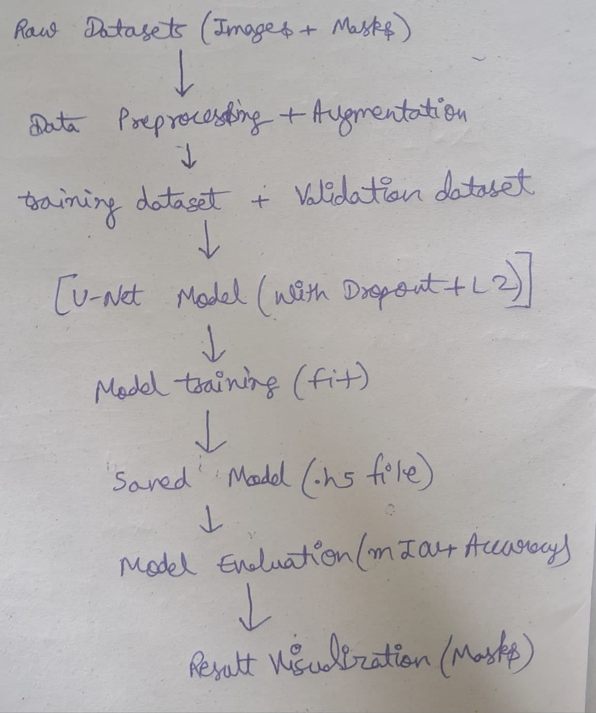

# 🚗 Road Segmentation with ROS & TensorFlow

## 🧠 Overview

This project integrates a **UNet-based TensorFlow segmentation model** with **ROS Noetic**, enabling real-time road segmentation from camera feeds. The system processes incoming images, generates binary masks and color overlays, and publishes them as ROS topics for visualization in **RViz**.

---

## ✨ Features

* 🔄 **Real-time image segmentation** using a pre-trained UNet model.
* 🖼️ Publishes segmentation output to two ROS topics:

  * `/seg/image_raw`: Grayscale binary mask (mono8).
  * `/seg/image_color`: Color overlay (rgb8).
* 🚀 Easy-to-launch pipeline using a ROS launch file.
* 📈 Visualization-ready in **RViz**.

---

## 🚪 Installation & Setup

### ⚡ Prerequisites

* Ubuntu 20.04 with **ROS Noetic**
* Python 3.8+
* TensorFlow 2.13.x
* OpenCV, `cv_bridge`, and standard ROS Python dependencies

### 📂 Workspace Setup

1. **Clone the repository** into your ROS workspace:

   ```bash
   cd ~/catkin_ws/src
   git clone https://github.com/mohit1221iitian/avera
   ```

2. **Build the workspace:**

   ```bash
   cd ~/catkin_ws
   catkin_make
   source devel/setup.bash
   ```

3. **Install Python dependencies:**

   ```bash
   pip install -r requirements.txt
   ```

---

## 🚀 Running the Project

1. **Start the segmentation node:**

   ```bash
   roslaunch segmentation_node segmentation.launch
   ```

2. **Open RViz** in a new terminal:

   ```bash
   rviz
   ```

3. **Add image displays** for:

   * `/seg/image_raw` (Encoding: `mono8`)
   * `/seg/image_color` (Encoding: `rgb8`)

---

## 📁 File Structure

```
avera/
├── code/                    # Core training & evaluation scripts
│   ├── data_loader.py
│   ├── evaluate.py
│   ├── prepare_dataset.py
│   ├── train.py
│   ├── unet_model.py
│   └── visualize_prediction.py
├── launch/                  # ROS launch files
│   └── segmentation.launch
├── models/                  # Model storage 
├── output/                  # Outputs: model, metrics, curves
│   ├── best_model.h5
│   ├── end-to-end_pipeline.jpg
│   ├── performance_metrics.png
│   ├── sample_segmented_output.png
│   └── training_curves.png
├── scripts/                 # ROS node
│   └── segmentation_node.py
├── rviz_segmentation.png    # RViz screenshot
├── CMakeLists.txt
├── package.xml
├── requirements.txt
├── README.md
└── .gitignore
```

---

## 🔧 Model Weights

The `best_model.h5` file is included in the `output/` directory. 

---

## 🖼️ Sample Outputs

Here are some visual results from the segmentation pipeline:

| Description            | Image                                         |
| ---------------------- | --------------------------------------------- |
| Rviz Segmentation      |                 |
| Training Curve         |        |
| Segmentation Output    |  |
| Performance Metrics    |     |
| Full Pipeline Overview |    |

---

## 💡 Model Training (Optional)

If you'd like to train the UNet model from scratch, use the scripts in the `code/` directory. Make sure to adjust paths in `train.py` and ensure the dataset is properly structured.

---

## ❓ Troubleshooting

* Ensure ROS environment is sourced before launching nodes:

  ```bash
  source ~/catkin_ws/devel/setup.bash
  ```
* Confirm your TensorFlow version is **2.13.x**.
* Check topic availability:

  ```bash
  rostopic list
  rostopic echo /seg/image_raw
  ```

---

## 📄 License

This project is licensed under the [MIT License](LICENSE).

---

> Made with ❤️ for real-time robotic perception.
